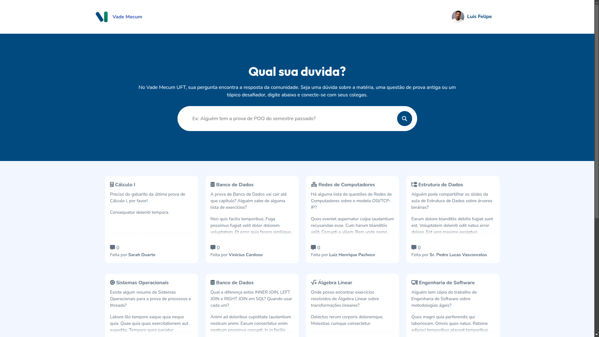

# 📚 Vade Mecum UFT

## Sobre o Projeto
O Vade Mecum UFT é uma plataforma colaborativa desenvolvida para estudantes da Universidade Federal do Tocantins (UFT). Nosso objetivo é facilitar o compartilhamento de perguntas e respostas, provas anteriores, cópias de trabalhos e materiais de estudo relevantes para as diversas disciplinas e cursos da universidade.

## 🚀 Funcionalidades Atuais
- Autenticação de Usuários: Registro, Login e Logout seguros.
- Perguntas e Respostas:
    - Crie e visualize perguntas sobre qualquer tópico acadêmico.
    - Envie respostas detalhadas para as perguntas.
    - Anexe arquivos (PDFs, DOCs, imagens) tanto em perguntas quanto em respostas (ex: provas, gabaritos, exercícios).
    - Filtre perguntas por disciplina e busque por palavras-chave.
- Perfis de Usuário: Informações básicas do usuário e histórico de contribuições.
- Modelos Robustos: Estrutura de banco de dados otimizada para Disciplinas, Perguntas, Respostas e Perfis de Usuário.
- API RESTful (com Django REST Framework): Base para integração com o mobile em Angular.
- Testes Unitários: Garantia de qualidade e funcionamento das principais funcionalidades.

## 🛠️ Tecnologias Utilizadas
- Backend: Python 3.x, Django, Django REST Framework
- Banco de Dados: SQLite (desenvolvimento), PostgreSQL (recomendado para produção)
- Frontend: HTML5, CSS3 (com Django Templates)
Controle de Versão: Git

<!-- 
## ⚙️ Instalação e Configuração
Siga os passos abaixo para configurar e rodar o projeto localmente.

Pré-requisitos
Python 3.8+
Git -->
